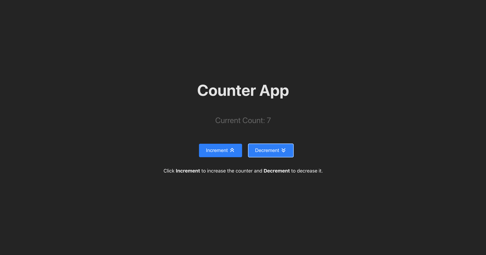
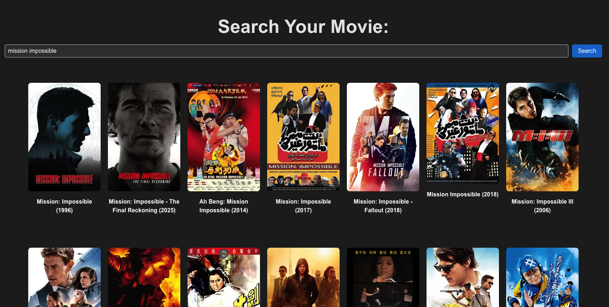
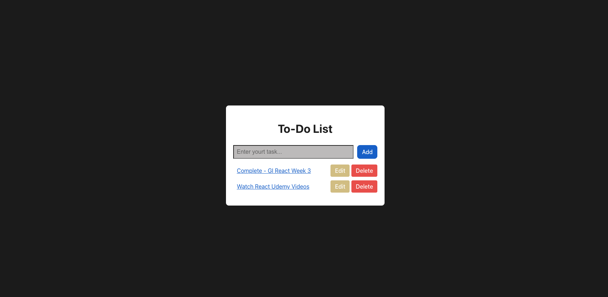

# Counter App (EASY) 
A simple counter application built using **React** and **React Hooks**.  
This project demonstrates the basic usage of the `useState` hook to manage state and update the UI dynamically.

- React Hooks

---

# Movie Search App (MEDIUM)

A movie search application built using **React**, **React Hooks**, and **React Router**.  
This project allows users to search for movies using an external API, view search results, and navigate to a detailed page for each movie.

- React Hooks & React Router & APIs

---

# To-do list App (HARD)

A simple and interactive **To-Do List application** built using **React**, **React Hooks**, and **React Router**.  
This project demonstrates how to manage state with hooks and navigate between multiple pages.

---

## Installation & Usage

1. Clone the repository  
   --> git clone git@github.com:MassowNdiaye/React-3.git
   
2. npm install
3. npm run dev